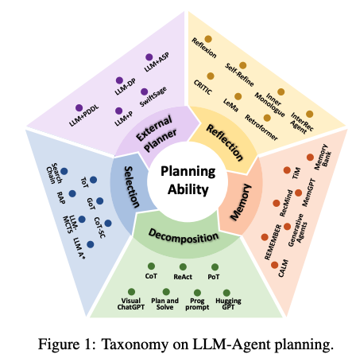
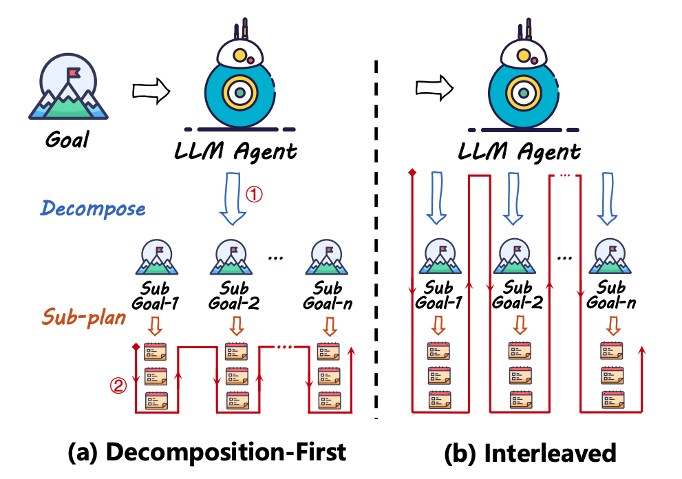
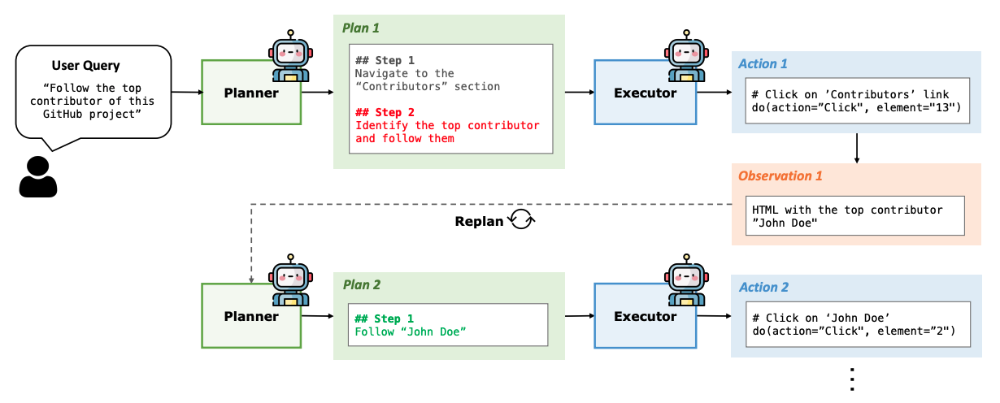

## Agent 运作流程概览

当前 Agent 的标准运作流程包含以下七个关键步骤：

1. **接收输入**：开发者提供的 system 背景 prompt + 用户的 prompt
2. **理解输入**：模型理解用户的意图，并提取关键信息
3. **推理规划**：模型根据用户输入和当前状态，进行推理和规划，确定下一步行动（**核心环节**）
4. **选择工具**：模型根据工具描述，来选择合适的工具
5. **执行行动**：Agent 使用工具执行行动，例如查询数据库、发送邮件等
6. **获取结果**：Agent 获取工具执行的结果
7. **输出结果**：Agent 将结果输出给用户，或进行下一步行动

其中第三步"推理规划"是整个 Agent 系统的核心，决定了 Agent 的智能水平和任务完成质量。

## Planning 设计核心问题

agent 如何需要理解用户的 prompt，调用起工具链条？

**学习资源**：

- https://blog.langchain.dev/planning-for-agents/
- https://www.willowtreeapps.com/craft/building-ai-agents-with-plan-and-execute
- https://blog.langchain.dev/planning-agents/

## LLM Planning 的五大核心方法

基于论文研究（https://arxiv.org/pdf/2402.02716），LLM Planning 主要包含五个相互关联而非互斥的方向：

> The five directions are interconnected rather than mutually exclusive

### 1. 任务分解 (Task Decomposition)

**核心思想**：将复杂任务分解为多个简单子任务。

#### 工作机制

- **分解优先型**：先完整分解任务，再逐个规划子任务
- **交错型**：边分解边规划，动态调整

#### 适用场景

- ✅ **多步骤复杂任务**：需要按顺序完成的长流程任务
- ✅ **目标明确的任务**：有清晰最终目标的任务
- ✅ **可分解的任务**：能够自然拆分为子步骤的任务

#### 应用实例

- **烹饪任务**："做一道宫保鸡丁" → 分解为：准备食材 → 处理鸡肉 → 调制酱汁 → 炒制 → 装盘
- **软件开发**："开发一个网站" → 分解为：需求分析 → 设计界面 → 编写代码 → 测试 → 部署
- **多模态任务**：HuggingGPT 将"生成一张猫的图片并配上文字描述"分解为：图片生成 → 图片理解 → 文字生成

### 2. 多计划选择 (Multi-Plan Selection)

**核心思想**：生成多个候选计划，通过搜索算法选择最优方案。

#### 工作机制

使用采样策略生成多个候选方案 → 计划评估：通过搜索算法（如树搜索）评估方案 → 最优选择：选择评分最高的计划执行

#### 适用场景

- ✅ **高风险决策任务**：失败代价高，需要谨慎选择的任务
- ✅ **多解决方案任务**：存在多种可行路径的问题
- ✅ **需要优化的任务**：追求最优解而非可行解的场景

#### 应用实例

- **路径规划**：从 A 地到 B 地，生成多条路线（高速、省道、景观路线），选择最优路径
- **投资决策**：制定多个投资组合策略，评估风险收益后选择最佳方案
- **数学问题求解**：Tree-of-Thought 在解决 24 点游戏时，生成多个计算路径并评估选择

### 3. 外部规划器辅助 (External Planner-Aided)

**核心思想**：结合专门的外部规划器，LLM 负责任务理解和形式化，外部规划器负责具体规划。

#### 工作机制

- **符号规划器**：如 PDDL，提供理论完备性和稳定性
- **神经规划器**：如强化学习模型，在特定领域高效规划

#### 适用场景

- ✅ **约束严格的任务**：有明确规则和约束条件的问题
- ✅ **专业领域任务**：需要领域专业知识的规划问题
- ✅ **效率要求高的任务**：需要快速生成最优解的场景

#### 应用实例

- **机器人路径规划**：LLM 理解"去厨房拿水杯"，PDDL 规划器生成具体移动路径避开障碍物
- **物流调度**：LLM 理解配送需求，专业调度算法优化配送路线
- **游戏 AI**：LLM 理解游戏目标，Monte Carlo Tree Search 生成最优走法

### 4. 反思与改进 (Reflection and Refinement)

**核心思想**：通过反思执行结果和失败经验，不断改进和优化计划。

#### 工作机制

初始规划：生成初始计划 → 执行监控：观察执行结果和环境反馈 → 反思分析：分析失败原因和改进空间 → 计划优化：基于反思结果改进计划

#### 适用场景

- ✅ **试错成本低的任务**：允许多次尝试的场景
- ✅ **动态环境任务**：环境会发生变化的情况
- ✅ **学习改进任务**：需要从经验中学习的长期任务

#### 应用实例

- **代码调试**：编写代码 → 运行测试 → 分析错误 → 修复 bug → 重新测试
- **文章写作**：初稿 → 自我评估 → 发现问题 → 修改完善 → 最终稿
- **游戏策略**：Reflexion 在 ALFWorld 环境中，通过反思失败尝试改进行动策略

### 5. 记忆增强规划 (Memory-Augmented Planning)

**核心思想**：利用记忆模块存储历史经验、知识和成功案例，在规划时检索相关信息作为参考。

#### 工作机制

- **RAG 方式**：将经验存储在外部知识库，规划时检索相关内容
- **参数嵌入**：通过微调将经验融入模型参数

#### 适用场景

- ✅ **经验依赖型任务**：需要历史经验指导的任务
- ✅ **知识密集型任务**：需要大量领域知识的专业任务
- ✅ **长期学习任务**：需要积累和复用经验的持续性任务

#### 应用实例

- **医疗诊断**：存储历史病例，遇到新患者时检索相似案例辅助诊断
- **客户服务**：记忆过往客户问题和解决方案，提供更好的服务
- **个人助理**：Generative Agents 记住用户的习惯和偏好，提供个性化建议

## 方法组合策略

实际应用中，这些方法往往需要组合使用以达到最佳效果：

- **任务分解 + 反思改进**：适用于复杂任务的动态调整
- **多计划选择 + 记忆增强**：基于经验的多方案决策
- **外部规划器 + 任务分解**：专业领域的复杂问题求解

## 逆向工程 Agent 实践应用

### 应用场景设定

**目标任务**：让 agent 帮助找出某个 hook 点的函数偏移地址 offset

**复杂性分析**：

- 可能初步计划寻找 export 和 import 符号表，结果发现 export 表为空（符号表被剥离）
- 只能从字符串入手，找到相关函数后进行 xref 分析
- xref 可能有多个选择，需要逐一探索才能找到正确路径
- 需要关注 rodata、虚函数表等信息，联合判断
- 由于可执行文件种类众多，编译技术和安全保护技术各异，agent 需要具备强专业知识和多种意外情况判断能力

### 核心需求分析

逆向分析 agent 的关键需求：

1. **分层复杂性**：从符号表 → 字符串 →xref→ 综合分析，天然适合任务分解
2. **动态调整需求**：遇到剥离符号表等意外情况需要改变策略
3. **试错空间存在**：静态分析允许多次尝试不同路径

### 架构设计方案

**主要框架**：任务分解 + 反思改进

#### 一级分解：逆向分析流程

**目标**：找到 hook 点函数偏移地址

**分解路径**：符号信息分析 → 字符串分析与定位 → xref 追踪 → 数据结构分析 → 综合验证与确认

#### 二级分解：子任务具体步骤

**子任务 1：符号信息分析**

- 检查 export 表 → 检查 import 表 → 检查调试符号
- **反思触发点**：如果符号被剥离 → 转向字符串分析

**子任务 2：字符串分析与定位**

- 扫描相关字符串 → 定位字符串引用 → 分析字符串上下文
- **反思触发点**：字符串质量评估 → 决定是否继续此路径

**子任务 3：交叉引用追踪**

- 对每个 xref 进行分析
- **多计划选择**：并行分析 n 个 xref 路径
- 评估每个路径的可信度
- **反思触发点**：路径评估 → 选择最有希望的路径继续深入

#### 辅助技术：记忆增强规划

如需加强逆向知识，可补充：

- 编译器特征库
- 保护机制库
- 成功案例库
- 函数模式库

### 技术实现细节

#### 叶子函数优先策略

先搜索叶子函数（无其他调用子函数），本策略旨在自动识别代码中的"最底层"实现单元，优先处理这些独立的小型功能模块，从而逐步由底至顶推进整个逆向工程过程。

#### 操作跟踪器（Action Tracker）

- 记录 LLM 执行的所有操作及对应地址，支持快速跳转
- 提供"自动接受"开关，控制是否自动应用 LLM 注释结果
- 支持逐条或批量处理待审核的注释操作
- 自动接受开启：连续执行可能提升准确性，但也可能引入"幻觉"
- 自动接受关闭：各操作相互独立，保证更高准确性但降低自动化程度

### 挑战与待解决问题

1. **多路径决策问题**：如何在多个 xref 路径中做出最优选择？
2. **失败判断标准**：怎样定义和识别分析失败？
3. **大文件处理**：如何处理上下文长度限制导致的大型汇编文件分析问题？

#### Plan-and-Act 模式探索

基于研究发现：(https://arxiv.org/pdf/2503.09572)

> In other words, LLMs excel at processing textual knowledge fast and humans excel at reasoning.

我们需要在文本处理速度和推理能力之间找到平衡点，特别是在处理复杂的二进制分析任务时。

## 总结

LLM Agent 的 Planning 设计需要根据具体应用场景选择合适的方法组合。在逆向工程这样的专业领域，任务分解和反思改进的组合显示出良好的适用性，但仍需要在实践中不断优化和完善具体的实现细节，构建更加智能和可靠的专业领域 Agent 系统。
