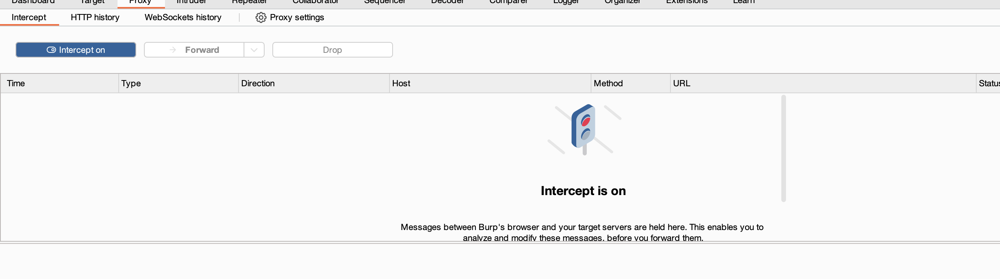
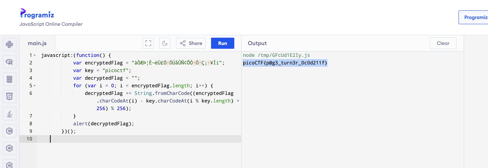
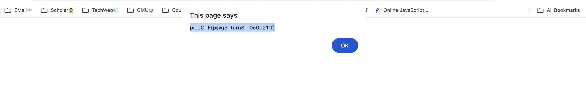
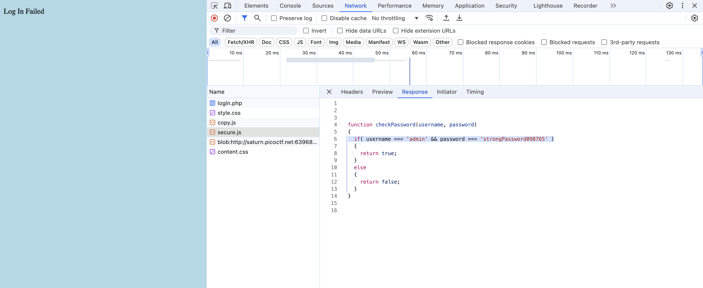
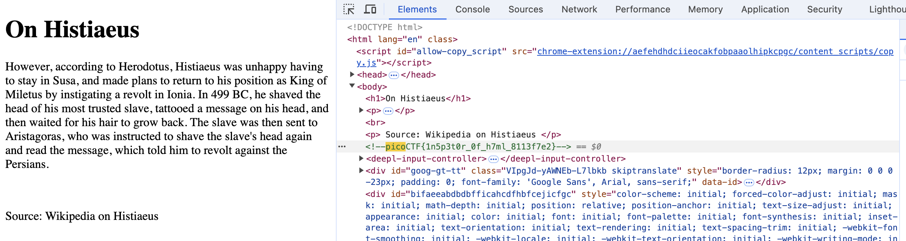
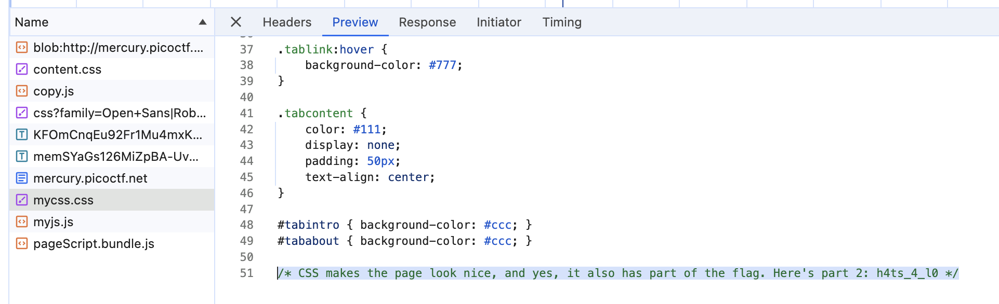
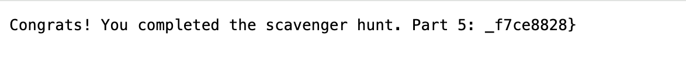
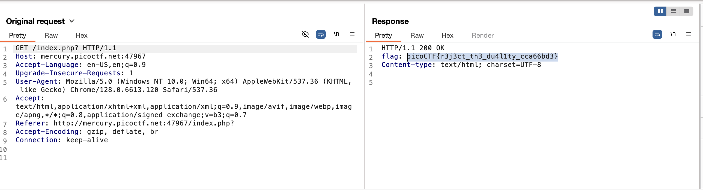
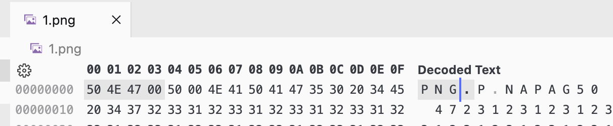

## WebDecode

shortcut in MacOS option+command+i to open web broswer


The flag is in base64, open the tool to transfer code into ascii.

## Unminify

By looking at the page source it is all on one line.

```
curl -s http://titan.picoctf.net:54349/ | grep -oE picoCTF{.*} --color=none | cut -d "\"" -f1
```

**`curl -s http://titan.picoctf.net:54349/`**:

- **`curl`**: This is a command-line tool used to transfer data from or to a server using various protocols (HTTP,
  HTTPS, etc.).
- **`-s`**: This flag stands for "silent" mode, which means it won’t show progress or error messages. It only outputs
  the content of the URL.
- **`http://titan.picoctf.net:54349/`**: This is the URL being accessed. The command will fetch the content from this
  address.

**`|`**:

- This is a pipe, which takes the output of the command on the left (`curl`) and uses it as the input for the command on
  the right (`grep`).

**`grep -oE picoCTF{.\*} --color=none`**:

- **`grep`**: A command-line utility for searching plain-text data for lines that match a regular expression.
- **`-o`**: This option tells `grep` to only output the matching part of the line, rather than the entire line.
- **`-E`**: This enables extended regular expressions, allowing more complex patterns.
- **`picoCTF{.\*}`**: This is the regular expression pattern being searched for. It looks for strings that start with
  `picoCTF{` and contain any characters (`.*`) until the closing brace.
- **`--color=none`**: This option disables color highlighting in the output.

**`| cut -d "\"" -f1`**:

- **`cut`**: This command is used to remove sections from each line of input.
- **`-d "\"" `**: This specifies the delimiter to be a double quote (`"`). `cut` will use this character to split the
  input.
- **`-f1`**: This option tells `cut` to output only the first field (the part before the first double quote).

## IntroToBurp

Open the burpsuite and open the Intercept when on the validation of OTP

delete the request on the line" otp= ".

DO NOT delete any space or blank!! Maybe because the server will excute the format check.



## Bookmarklet

Method 1: Run the javascript code online.



Method2: create a bookmark and enter the js code as the url. Then open it in a new window. The flag will pop out.



So the broswer will take it as js code and calculate the value of url will automatically.

## Local Authority

Check the secure.js through the web inspector.



## Inspect HTML

Check the web inspector and search for picoCTF



## Includes

Inspect of files from "say hello".

The first part of flag is in the comment of style.css. The rest of flag is in the script.js.


## Cookies

The cookies seems like a random integer.

If i put in "wwy", it will return name=-1. If I put in the suggested string "snickerdoodle", it will return name=0.


To try the correct number of name:

```python
#!/bin/python3
import requests
import re

for i in range(50):
    cookie = 'name={}'.format(i)
    headers = {'Cookie': cookie}

    r = requests.get('http://mercury.picoctf.net:27177/check', headers=headers)
    if (r.status_code == 200) and ('picoCTF' in r.text):
        match = re.search(r'picoCTF{[^}]*}', r.text)
        if match:
            print(match.group(0))                                                                                                 
```

Excute python:


## Scavenger Hunt

According to the hint, check the inspector for js,css and html.

1. The first part is in the html file:

<!-- Here's the first part of the flag: picoCTF{t -->


2. The second part is in the css file:

h4ts_4_l0



3. The third part in the JS file:

Devs don't want these spiders to reach and `index` every part of the website, we use a special file called `robots.txt`

Search URL :http://mercury.picoctf.net:39491/robots.txt

```
# Part 3: t_0f_pl4c
```


4. The fourth part:

Need to access the `.htaccess` file

```
# Part 4: 3s_2_lO0k
```

> The `.htaccess` file is a configuration file used by the Apache web server. It allows web administrators to define
> server configuration options for specific directories without modifying the main server configuration files.


5. The fifth part:

   It leads us to the *.DS_Store* file,

   > `.DS_Store` is a hidden file automatically created by the macOS operating system. Its main purpose is to store
   visual information and metadata about folders.

```
Part 5: _f7ce8828}
```



summary flag: picoCTF{th4ts_4_l0t_0f_pl4c3s_2_lO0k_f7ce8828}

## GET aHEAD

Use burpsuite to Modify the GET request into HEAD request, the server will return the flag value.



## dont-use-client-side

The password is in the js script in html file.

Check html file and reorganize the flag: picoCTF{no_clients_plz_b706c5}

```js
  function verify() {
    checkpass = document.getElementById("pass").value;
    split = 4;
    if (checkpass.substring(0, split) == 'pico') {
        if (checkpass.substring(split * 6, split * 7) == '706c') {
            if (checkpass.substring(split, split * 2) == 'CTF{') {
                if (checkpass.substring(split * 4, split * 5) == 'ts_p') {
                    if (checkpass.substring(split * 3, split * 4) == 'lien') {
                        if (checkpass.substring(split * 5, split * 6) == 'lz_b') {
                            if (checkpass.substring(split * 2, split * 3) == 'no_c') {
                                if (checkpass.substring(split * 7, split * 8) == '5}') {
                                    alert("Password Verified")
                                }
                            }
                        }

                    }
                }
            }
        }
    } else {
        alert("Incorrect password");
    }

}
```

## logon

Use a random user name and password, we can find that it can login in successfully.

Check the website's cookie. The admin cookies = False.


So we can guess that the secure mode is decided by the user' type.

Modify the admin type into ``` admin=True```, update the website then we can see the flag.


## Insp3ct0r

1. Part1: In the html file

<!-- Html is neat. Anyways have 1/3 of the flag: picoCTF{tru3_d3 -->

2. Part2: In comment of the ` mycss.css`file.

   /* You need CSS to make pretty pages. Here's part 2/3 of the flag: t3ct1ve_0r_ju5t */

3. Part3 : In the comment of  ``` myjs.js```file.

   /* Javascript sure is neat. Anyways part 3/3 of the flag: _lucky?2e7b23e3} */

Summary: picoCTF{tru3_d3t3ct1ve_0r_ju5t_lucky?2e7b23e3}

This is easier than Scavenger Hunt!!! I'm confused about the order of these questions...

## where are the robots

According to the hints, find what is in the `robots.txt` file?


Check the 1bb.4c.html





