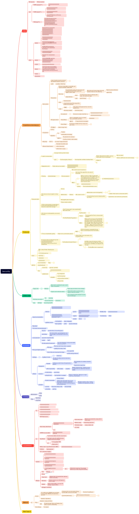

# My Cybersecurity Knowledge Mind Map: A Journey Through Security Fundamentals

## Why I Created This Mind Map

As a graduate student at Carnegie Mellon University studying Information Security, I found myself drowning in a sea of cybersecurity concepts, protocols, and attack vectors. From web vulnerabilities to cryptographic protocols, from malware analysis to network security - the field is vast and interconnected.

## What's Inside: A Comprehensive Security Overview

This mind map covers six major domains of cybersecurity knowledge:

### 🌐 Web Security

The foundation starts with **web vulnerabilities** that every security professional should understand:

- **SQL Injection**: The classic attack exploiting unsanitized database queries
- **Cross-Site Scripting (XSS)**: Malicious script injection affecting user browsers
- **Cross-Site Request Forgery (CSRF)**: Exploiting user authentication for unauthorized actions
- **Server-Side Request Forgery (SSRF)**: Making servers access unintended internal resources

I also documented the complete **penetration testing methodology** for unknown websites:

1. **Information Gathering**: WHOIS data, social engineering, subdomain enumeration
2. **Vulnerability Scanning**: Automated discovery of security weaknesses
3. **Exploitation**: Converting vulnerabilities into actual access
4. **Privilege Escalation**: Moving from limited to administrative access
5. **Log Cleaning & Reporting**: Professional documentation and cleanup

### 💰 Cryptocurrency & Blockchain Security

Understanding the security implications of decentralized systems:

- **Bitcoin Fundamentals**: How blockchain prevents double-spending through consensus
- **Mining & Proof-of-Work**: The cryptographic puzzle-solving that secures networks
- **Smart Contracts**: Ethereum's programmable transaction system
- **Anonymity Challenges**: Why Bitcoin isn't truly anonymous
- **51% Attacks**: The fundamental vulnerability of consensus mechanisms

### 🔐 Security Protocols & Cryptography

Deep dive into the protocols that secure our digital communications:

- **Protocol Design Principles**: The 8 fundamental rules for secure protocol design
- **Famous Protocol Attacks**: Real-world case studies including Denning-Sacco and Needham-Schroeder
- **SSL/TLS Handshake**: How secure connections are established
- **Authentication vs. Key Establishment**: Different approaches to securing communications

### 🏛️ Security Economics & Human Factors

The often-overlooked business and psychological aspects of security:

- **Network Effects**: How security benefits scale with adoption
- **Human-in-the-Loop**: Why users are often the weakest link
- **Password Security**: The fundamental challenge of authentication
- **Phishing Psychology**: How attackers exploit human cognitive biases

### 💻 Software Security

Low-level technical defenses and attacks:

- **Common Attacks**: Stack overflows, heap exploitation, format string bugs
- **Defense Mechanisms**: Stack canaries, ASLR, DEP/NX bit protection
- **Malware Analysis**: My methodology for analyzing unknown software safely
- **Control Flow Integrity**: Modern protection against code-reuse attacks

### 🌍 Network Security & Anonymity

Protecting communications and identity online:

- **Anonymity Networks**: From simple proxies to sophisticated mix-nets
- **Tor Architecture**: How onion routing provides anonymous communication
- **VPN vs. Proxy**: Understanding the trade-offs in privacy tools
- **Network Traffic Analysis**: How attackers can still track anonymous users

---

