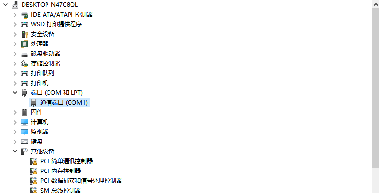
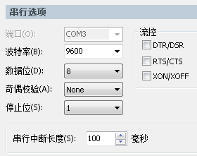
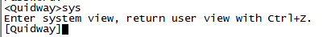
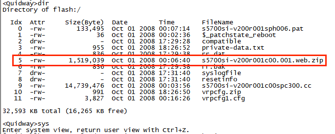

## 一、连接（SecureCRT为例）：
### 1.查看端口
    我的电脑-右键管理-设备管理器

### 2.	远程工具建立连接
    协议——serial
    配置如下：

### 3.	重置（选）
    reset saved-configuration → ‘y’
    reboot → ‘n’→ ‘y’

### 4.	配置模式
    sys
    //进入配置模式

    
    dis cur
    //display current 查看目前配置

    q
    //退出当前模式

*******************************************

## 二、分组操作：
### 将交换机上的不同端口分为不同的虚拟组别，方便进行批量操作。
### 创建/进入组：
    port-group 1
    //进入或创建组1，数字可以自定义

    group-member gigabitethernet 0/0/1 to gigabitethernet 0/0/8
    //将1-8端口打包为 “组1”

*******************************************

## 三、设置端口类型：
### 三种端口区别：
    https://blog.csdn.net/mansky0618/article/details/100033123?spm=1001.2101.3001.6661.1&utm_medium=distribute.pc_relevant_t0.none-task-blog-2~default~CTRLIST~default-1-100033123-blog-122424064.pc_relevant_aa&depth_1-utm_source=distribute.pc_relevant_t0.none-task-blog-2~default~CTRLIST~default-1-100033123-blog-122424064.pc_relevant_aa&utm_relevant_index=1
### 进入端口：
	port-group 1			
    //进入分组 “1”，即批量操作端口1-8

	interface gigabitethernet 0/0/6   
    //进入端口6
### 设置端口类型：
    port link-type access
    //设置为access端口

    port link-type trunk
    //设置为trunk端口

### 三种端口类型转换：
    https://forum.huawei.com/enterprise/zh/thread-801465.html
***
## 四、Vlan设置：
### Access：一个端口对应一个网段
### Trunk:一个端口可以对应多个网段

### 进入网络段设置：
    interface Vlanif33
    //进入33的vlan设置
### 设置IP：
    ip address 10.128.19.33 255.255.255.0
    //配置名称为33的vlan IP与掩码
    //定义WEB访问地址

***
## 五、路由功能：
### 添加路由功能：
    ip route-static 10.128.0.0 255.255.255.0 10.129.85.254
    //设置路由IP、掩码、网关

*******************************************

## 六、增添用户
### 进入用户设置模式：
    aaa
    //默认
### 用户密码：
    local-user wwy password cipher 531
    //设置用户名为wwy的密码为531
    //密文储存
### 增添服务权限：
    local-user wwy service-type http ssh telnet web
    //用户wwy可以使用此四种服务进行验证
### 命令级别：
    local-user wwy level 10
    //赋予wwy 10级的用户权限

*******************************************

## PS：
### 开启http服务
    dir
    //查看zip文件
    http server load xxx.zip
    http server enable
    
